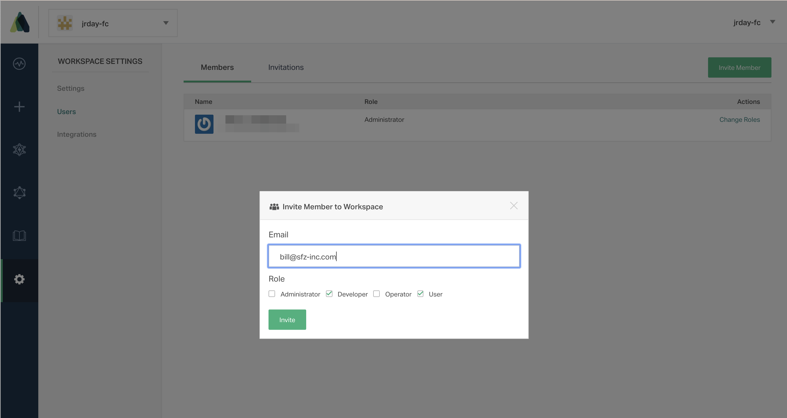

Workspace members can use any of the Atomist user interfaces with your workspace.

## Inviting a Member

Only Administrators can invite new members to a workspace. Invite a new member from **Settings > Users > Invite Member**.

When you invite a new member, you can choose which role(s) you would like them to have. A member can have one or more roles.

## Managing Members and Invites

Administrators can:

* Resend an invitation
* Cancel an invitation
* Change member roles
* Remove a member from the workspace

## Roles

A workspace member can have one or more roles within the workspace. Only a workspace Administrator can change user roles.

| Role | Description |
|---|---|
| Administrator | Has full control over all aspects of the workspace |
| Developer | For users developing an SDM connected to this workspace |
| Operator | For users operating an SDM connected to this workspace |
| User | User of the workspace |

