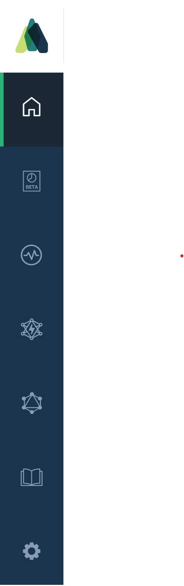
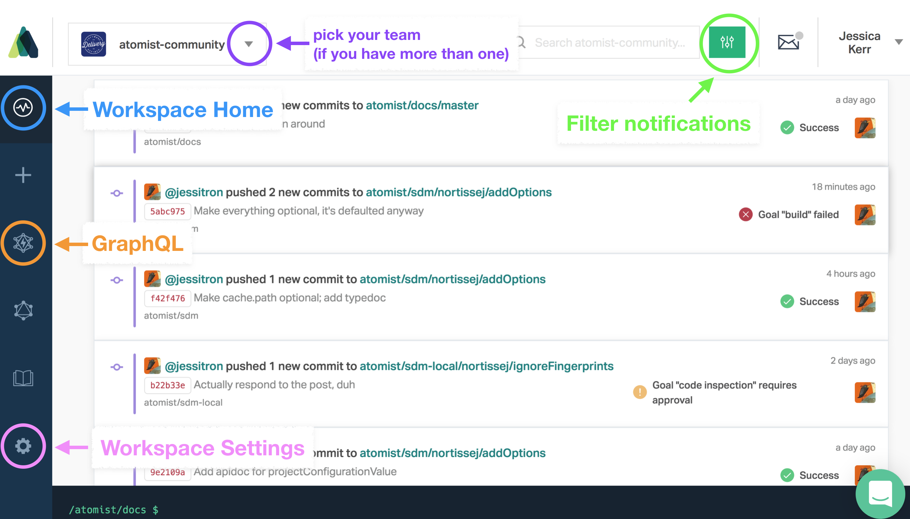

The Atomist web interface is located at [app.atomist.com](https://app.atomist.com). Here,
you can view and manage drift, see some notifications, run GraphQL queries against your data, and administer your
Atomist workspace.

<!-- TODO update this image. And make this page have all the sections. -->

## Drift Management

<!-- TODO picture of drift report symbol --> Interact with your [Drift Report](drift-report.md) by clicking this.

## Events

<!-- TODO: event symbol -->

This page shows a list of [Lifecycle Events](lifecycle.md). You can filter it by person or repository using the filter button. Click on a notification to see details, including useful buttons.

This page includes a list of Notifications on the right.

## SDM list

<!-- SDM list symbol -->

[See and administer](sdm-list.md) the Software Delivery Machines (SDMs) in your workspace.

## GraphQL

Atomist constructs a graph of your organization's events, so that you can get the context you need to act on them. For instance, a push is linked to commits which link to people which link to chat users that you can DM. Issues are linked to commits that reference them.

<!-- TODO graphql symbol --> Click this symbol to access the GraphQL explorer.

## Docs
<!-- TODO docs symbol -->
You're already here.

## Settings

<!-- TODO where are these now? -->
