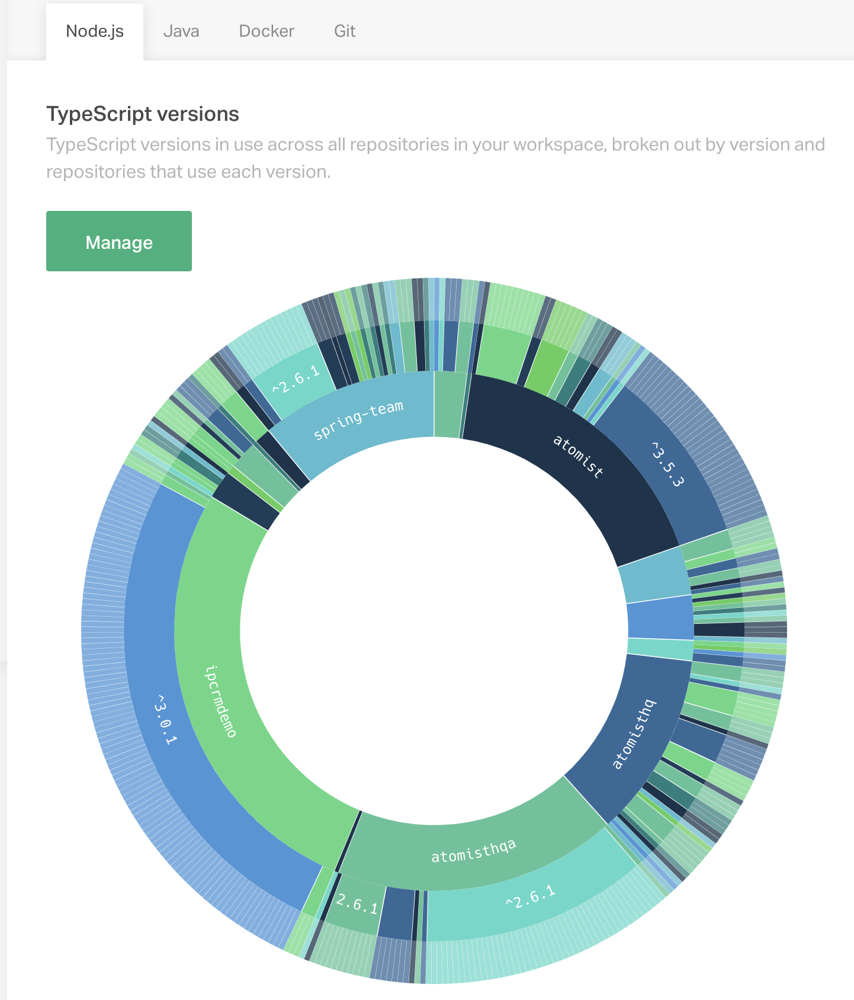
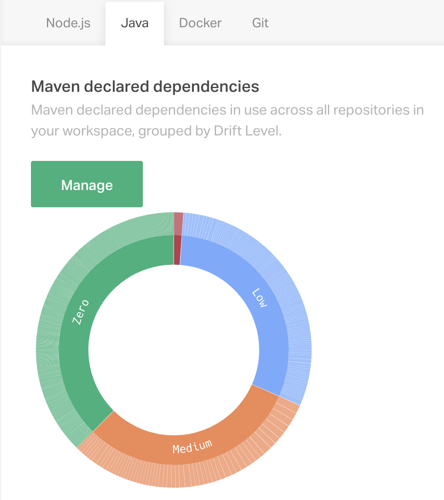
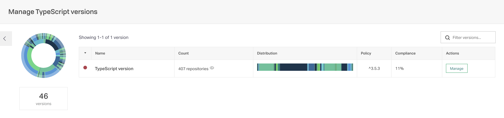
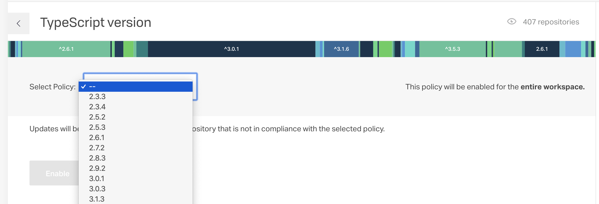

The Drift Report displays [divergence][rods-drift-blog] in aspects of code, configuration and process across all of your repositories.

[rods-drift-blog]: https://blog.atomist.com/whats-lurking/ (Define Technology Drift)

What version of your runtime and libraries are different applications leaning on?

Which repositories have a bunch of git branches outstanding?

Who is exposing a nonstandard port?

As organizations grow, software grows too. Pieces of software grow at different rates, and what once was normal can be a nasty surprise in the present.
"Does some library still use Java 6?" "Why is this app stuck in Node 8?!" "What are they doing with port 2866?"
The Drift Report helps you find these surprises, and then do something about it!

## See the Drift Report

Access the Drift Report in the [Atomist web app](https://app.atomist.com). Select the pie chart icon on the left navigation for "Drift Management."

When you first enroll or add a GitHub organization, it may take some time to analyze the repositories. After that, Atomist will update the data on each push.

Currently, the Drift Report covers aspects of four technologies: Node, Java, Docker, and Git. (Each has a tab.)

These represent aspects of code that many organizations are interested in. Atomist is more than a service: it is also a platform for [creating](../quick-start.md) the windows into code that your organization needs.
Hopefully these aspects are useful in themselves, and give you ideas of what else you'd like to map in your organization's repositories.

### Example Drift Report: TypeScript Versions

For instance, one of the Node-related aspects displayed is TypeScript version (pictured).

This particular [sunburst chart](https://en.wikipedia.org/wiki/Pie_chart#Ring) has three rings: the inner ring is GitHub organization (your workspace might have one or several; the one pictured has many, including 'atomist').

The middle ring contains variants -- all the versions of TypeScript specified in any repository.
The outer ring has each repository, grouped
by version of TypeScript and organization.
You can click on segments in this graph to zoom in.

### Example Drift Report: Maven Dependencies

Some Drift Reports work at a higher level. While TypeScript version
is one property of the code, other aspects group properties together
and show you which ones vary the most.

The NPM and Maven Dependency reports lets you see where the drift is strongest. Over on the Java tab, the Maven Dependency sunburst looks like this:

This sunburst chart has two rings. The inner ring is a band of drift severity. In the outer band, each segment represents the property that's drifting -- in this case, a maven dependency with varying versions.

In the pictured chart, many Maven dependencies have zero drift: there is only one version in use in all of our repositories. Other dependencies have more drift. Hovering over the segments under Medium, I learned that `junit` has seven variants.

To investigate further, click the "Manage" button.

## Manage the Drift

After you click "Manage" on the top-level drift report, you can see details of the aspect. Each aspect lets you manage one or more properties (we call them fingerprints) of your code. The TypeScript Version
aspect has exactly one:

Here, you can see the count of repositories (407) with a TypeScript version,
along with a graph of the distribution of the variants in TypeScript version. If you click on the little eye next to the count of repositories, you'll see a list of them, along with the TypeScript version of each.

From here, click on the next "Manage" button to set a policy.

### Set Policy

When you want to guide your organization toward a single ideal state,
use Atomist to set that policy and give people a smooth path toward it.

A "Select Policy" dropdown offers all the variants currently found in any of your repositories. Choose the one you want everyone to move toward.

How quickly do you want to push your organization toward the standard you just chose?

Atomist can issue pull requests that update the TypeScript Version (or another NPM dependency, or a Maven dependency...) to match your policy.

**One:** before you enable the policy, click "Choose Repo to Try" to create one automated pull request.

**All:** After you click Enable to turn on the policy, you can push "Send PRs Now" and create pull requests for every repository with a TypeScript version that doesn't match your policy.

**Gradually:** After you enable the policy, Atomist will respond to pushes
that don't match it. For repositories [linked to a chat channel](lifecycle.md#linked-channels), Atomist will send a friendly message to that
channel offering to make a pull request. For repositories that haven't set up this line of communication, Atomist will issue the pull request.

These gradual nudges toward consistency let each team reduce drift on their own timescale.

## Customize

Everyone has library dependencies. Everyone has git branches. And everyone has their
own concerns that the rest of the world doesn't share.

You can write a function to scrutinize code for the data that matters to you.
Then investigate the variety in that property across your organization,
using the Atomist platform. [Start writing your own aspects](../developer/aspects.md) using the open source [org-visualizer][org-viz-github] (no enrollment needed).

[org-viz-github]: https://github.com/atomist/org-visualizer

Scale up your understanding and control of software. Encode what you want to know, and then Atomist can draw you a map, across a dozen repositories or a thousand.
